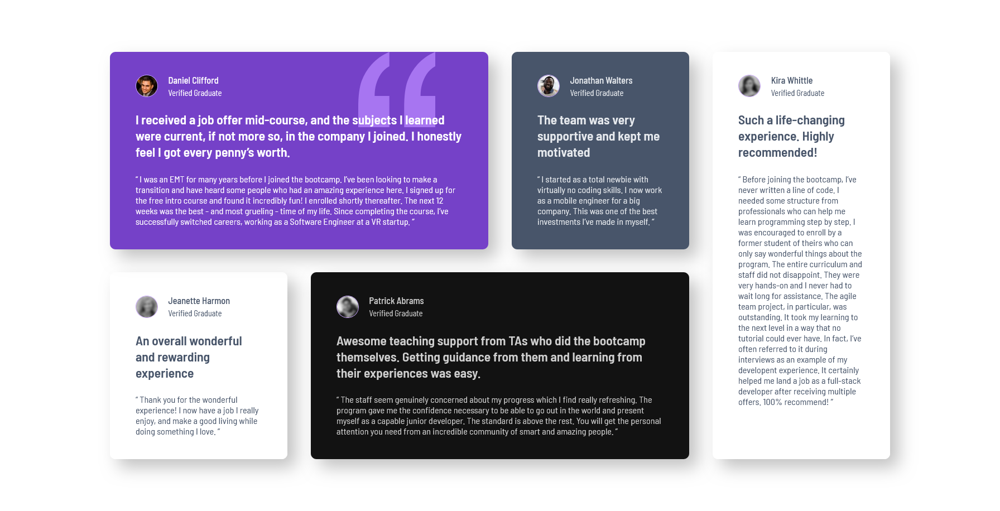

# Frontend Mentor - Testimonials grid section solution

This is a solution to the [Testimonials grid section challenge on Frontend Mentor](https://www.frontendmentor.io/challenges/testimonials-grid-section-Nnw6J7Un7). Frontend Mentor challenges help you improve your coding skills by building realistic projects. 

Been a while since I last did frontendmentor, it's good to be back. Definitely relied on youtube tutorials to refresh my understanding of the css grid, along with some help from AI whne I faced issues with making it responsive.

## Table of contents

- [Overview](#overview)
  - [The challenge](#the-challenge)
  - [Screenshot](#screenshot)
  - [Links](#links)
- [My process](#my-process)
  - [Built with](#built-with)
  - [What I learned](#what-i-learned)
  - [Continued development](#continued-development)
- [Author](#author)

**Note: Delete this note and update the table of contents based on what sections you keep.**

## Overview

### The challenge

Users should be able to:

- View the optimal layout for the site depending on their device's screen size

### Screenshot




### Links

- Solution URL: [Add solution URL here](https://your-solution-url.com)
- Live Site URL: [Add live site URL here](https://your-live-site-url.com)

## My process

### Built with

-  HTML and CSS
- Flexbox
- CSS Grid
- Mobile-first workflow
- Sass

### What I learned

Use this section to recap over some of your major learnings while working through this project. Writing these out and providing code samples of areas you want to highlight is a great way to reinforce your own knowledge.

It has been a while since I last did a frontendmentor challenge so I was definitely rusty from the start. Initially I set the height of the body as below: 

To see how you can add code snippets, see below:

```css
body {
  height: 100vh;
}
```

Not realizing that this fixes the height to 100vh, causing sections of my grid to be cutout when it exceeded that viewport height while I was creating the mobile first workflow. 

For the padding and margins I set the fontsize on the html document to be 13px and then used this [website](https://nekocalc.com/px-to-rem-converter) and calculated what rem sizes I should be using relative to the root font size of 13px. Definitely used a lot of eyeballing to get it as close to the original as possible. 

For the best part, the grid-container I started off with the usual grid row and grid column template and was using different values of 100px, 300px and more. I relied on this [tutorial](https://www.youtube.com/watch?v=EiNiSFIPIQE&t=24s) and from there I learn the way to make it responsive was to do this: 

```css
.grid-container{
    display: grid;
    // by using minmax, I can make it so that it takes more space
    // as the width of screen increases
    grid-template-columns: repeat(auto-fit, minmax(300px, 1fr));
    grid-gap: 2.54rem;
}
```
So using the repeat keyword to make the styling more concise and the auto-fit keyword, which sizes the sections of the grid according to the available screen width. I used the min max function too, to set the MIN width to be 300px and max to be 1fr, 1fr is a unit that makes sure that each section takes an even amount of space. 

Since I got back to using SASS after who knows how long I used plenty of nesting wherever I could to reduce the number of lines of css and to make the code more readable. 

Adding the quotation was also neat, felt good to finally apply the z-index of -9999. 

Decided to use a media query at the end so target screens of 1440p as below and repositioned the containers to align with the preview image: 

```css
@media screen and (min-width: 1370px) {
    /* CSS rules to be applied when the condition is TRUE */
    // body {
    //   background-color: lightblue;
    // }
    // so we restructure the elements on the grid based on this 
    
    .grid-container{
        grid-template-columns: repeat(4, 255px);

        .grid-container-1{
            grid-area: 1 / 1 / 2 / 3;

            .quotation{
                display: revert;
            }
        }

        // it swaps positions with another container, if that spot is already taken
        .grid-container-3{
            grid-area: 2 / 1 / 3 / 2;
        }

        .grid-container-5{
            grid-area: 1 / 4 / 3 / 5;
        }

        .grid-container-4{
            grid-area: 2 / 2 / 3 / 4;
        }
    }
  }
```

When I got stuck at certain parts such as why the grid was being cut off and why the grid template wasn't working as I expected it to, AI came to my resuce to explain where I was going wrong and corrected my one two lines of code with more appropriate measures. 


### Continued development

I spent a lot of time working on other projects that focused just as much on the backend than the frontend. Therefore my skills have become quite rusty since I'm much more used to the tailwindcss that you see on the Next.js framework. However, I'm interested in continuing more challenges and gaining more skills now that I have the time for it. 

## Author

- Frontend Mentor - [@BluffSet7340](https://www.frontendmentor.io/profile/BluffSet7340)